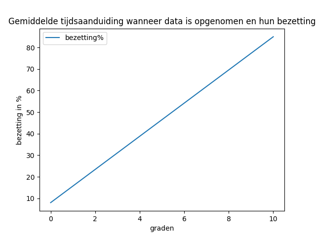
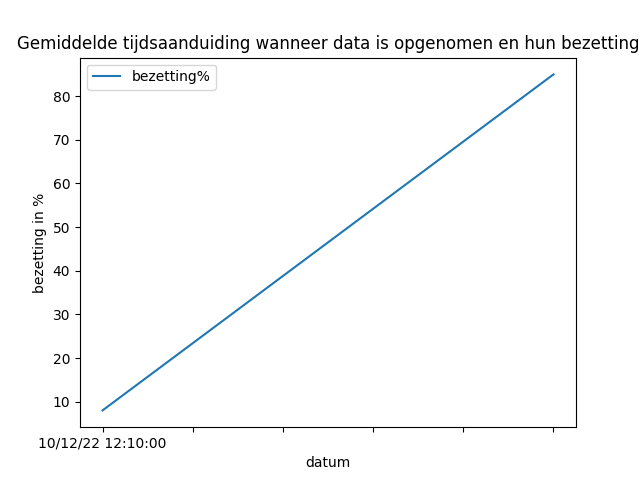
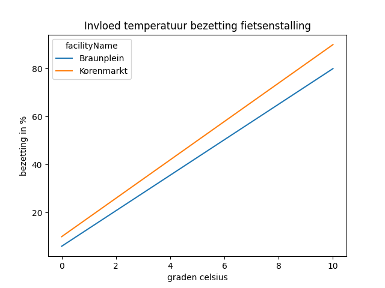
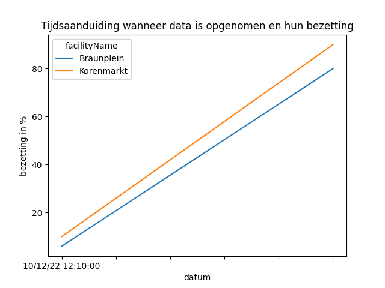

Invloed van temperatuur en tijdsaanduiding op de bezetting van fietsenstalling Braunplein en Korenmarkt te Gent. 
=================================================================================================================

Contents
========

* [Inleiding](#inleiding)
* [Algemene analyse](#algemene-analyse)
	* [Invloed van temperatuur op de bezetting](#invloed-van-temperatuur-op-de-bezetting)
	* [Invloed van tijdsaanduiding op de bezetting](#invloed-van-tijdsaanduiding-op-de-bezetting)
* [Individuele analyse](#individuele-analyse)
	* [Invloed van temperatuur op individuele bezetting](#invloed-van-temperatuur-op-individuele-bezetting)
	* [Invloed van tijdsaanduiding op de individuele bezetting](#invloed-van-tijdsaanduiding-op-de-individuele-bezetting)

# Inleiding

Dit rapport beschrijft en analyseert de invloed van temperatuur en tijdsaanduiding op de bezetting van fietsenstalling Braunplein en Korenmarkt te Gent. De data werd verkregen aan de hand van een publieke api van de stad Gent, [link naar api](https://data.stad.gent/explore/dataset/real-time-bezettingen-fietsenstallingen-gent/api/) . Dit rapport is gemaakt voor het vak linux for data scientists aan de Hogent.   

**IMPORTANT:** dit rapport is gemaakt voor educatieve doeleinden, er kunnen fouten inzitten.

# Algemene analyse

In de algemene analyse kijken we naar de gemmidelde waarde van beide fietsparkingen. Later in het rapport worden beide fietsparkingen apart besproken.
## Invloed van temperatuur op de bezetting

    

``Conclusie:`` Lorem ipsum dolor sit amet, consectetur adipiscing elit. Vivamus pharetra interdum vestibulum. Sed feugiat suscipit suscipit. Lorem ipsum dolor sit amet, consectetur adipiscing elit. Lorem ipsum dolor sit amet, consectetur adipiscing elit. Maecenas elementum congue velit, non aliquet ante sollicitudin eget. Vestibulum ligula augue, luctus sed tortor eget, ornare pellentesque tortor. Fusce scelerisque arcu a augue condimentum commodo. Praesent id rhoncus mauris, et ornare augue. Donec a lectus quis massa vulputate ullamcorper.
## Invloed van tijdsaanduiding op de bezetting

    

``Conclusie:`` Lorem ipsum dolor sit amet, consectetur adipiscing elit. Vivamus pharetra interdum vestibulum. Sed feugiat suscipit suscipit. Lorem ipsum dolor sit amet, consectetur adipiscing elit. Lorem ipsum dolor sit amet, consectetur adipiscing elit. Maecenas elementum congue velit, non aliquet ante sollicitudin eget. Vestibulum ligula augue, luctus sed tortor eget, ornare pellentesque tortor. Fusce scelerisque arcu a augue condimentum commodo. Praesent id rhoncus mauris, et ornare augue. Donec a lectus quis massa vulputate ullamcorper.
# Individuele analyse

De specifieke analyse bekijkt en analyseerd beide fietsparkingen apart.
## Invloed van temperatuur op individuele bezetting

    

``Conclusie Braunplein: `` Lorem ipsum dolor sit amet, consectetur adipiscing elit. Vivamus pharetra interdum vestibulum. Sed feugiat suscipit suscipit. Lorem ipsum dolor sit amet, consectetur adipiscing elit. Lorem ipsum dolor sit amet, consectetur adipiscing elit. Maecenas elementum congue velit, non aliquet ante sollicitudin eget. Vestibulum ligula augue, luctus sed tortor eget, ornare pellentesque tortor. Fusce scelerisque arcu a augue condimentum commodo. Praesent id rhoncus mauris, et ornare augue. Donec a lectus quis massa vulputate ullamcorper.

``Conclusie Korenmarkt: `` Lorem ipsum dolor sit amet, consectetur adipiscing elit. Vivamus pharetra interdum vestibulum. Sed feugiat suscipit suscipit. Lorem ipsum dolor sit amet, consectetur adipiscing elit. Lorem ipsum dolor sit amet, consectetur adipiscing elit. Maecenas elementum congue velit, non aliquet ante sollicitudin eget. Vestibulum ligula augue, luctus sed tortor eget, ornare pellentesque tortor. Fusce scelerisque arcu a augue condimentum commodo. Praesent id rhoncus mauris, et ornare augue. Donec a lectus quis massa vulputate ullamcorper.
## Invloed van tijdsaanduiding op de individuele bezetting

    

``Conclusie Braunplein:`` Lorem ipsum dolor sit amet, consectetur adipiscing elit. Vivamus pharetra interdum vestibulum. Sed feugiat suscipit suscipit. Lorem ipsum dolor sit amet, consectetur adipiscing elit. Lorem ipsum dolor sit amet, consectetur adipiscing elit. Maecenas elementum congue velit, non aliquet ante sollicitudin eget. Vestibulum ligula augue, luctus sed tortor eget, ornare pellentesque tortor. Fusce scelerisque arcu a augue condimentum commodo. Praesent id rhoncus mauris, et ornare augue. Donec a lectus quis massa vulputate ullamcorper.

``Conclusie Korenmarkt:`` Lorem ipsum dolor sit amet, consectetur adipiscing elit. Vivamus pharetra interdum vestibulum. Sed feugiat suscipit suscipit. Lorem ipsum dolor sit amet, consectetur adipiscing elit. Lorem ipsum dolor sit amet, consectetur adipiscing elit. Maecenas elementum congue velit, non aliquet ante sollicitudin eget. Vestibulum ligula augue, luctus sed tortor eget, ornare pellentesque tortor. Fusce scelerisque arcu a augue condimentum commodo. Praesent id rhoncus mauris, et ornare augue. Donec a lectus quis massa vulputate ullamcorper.  
  

Project gemaakt door [Pieterjan Van Landeghem](https://www.linkedin.com/in/pieterjan-van-landeghem-339b7b163/).  

Dit rapport is gemaakt voor het vak linux for data scientists aan de Hogent.  

Published on 2022-12-10_11:59:56
